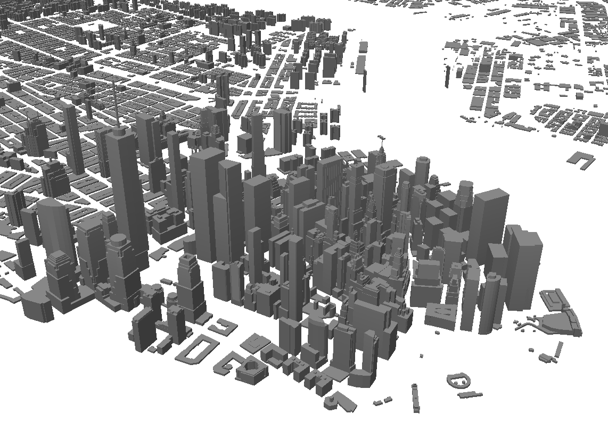

# OSM Bright

This is a basic demo of building extrusion in Mapbox GL. To use this, be sure to modify the URL in the sources of `style.json` to the appropriate address.
Feel free to use this style as an example to use with your own styles!

## Preview

